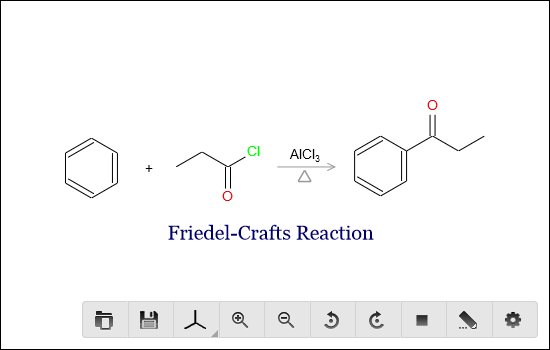
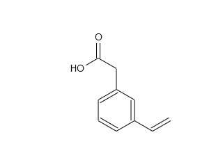
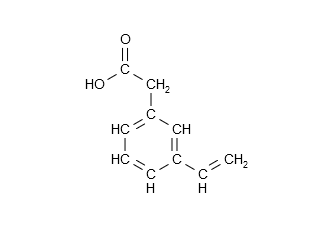
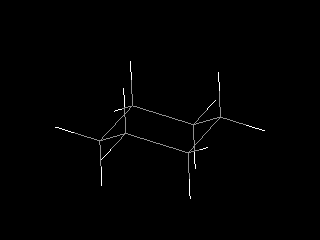
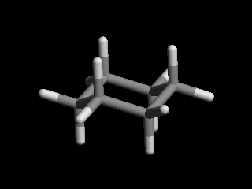
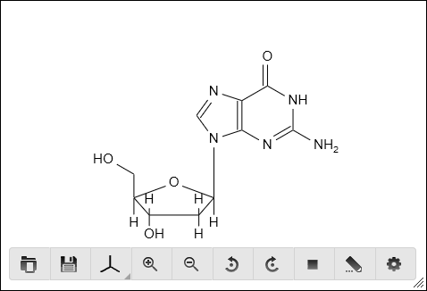
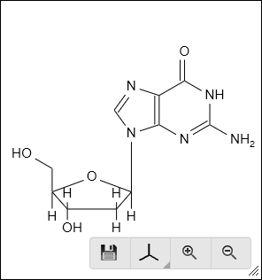
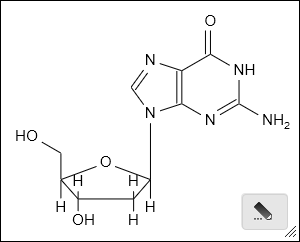
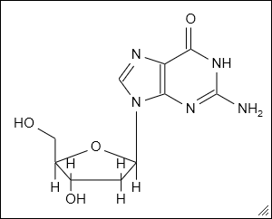

Chem Viewer Widget
==================

Chem viewer is one of the most important widget in Kekule.js toolkit.
It provides the ability to easily display molecule and other chemistry
objects. User can interacts with displayed objects directly with mouse
or touch or through an optional toolbar.



  < Chem Viewer UI in 2D mode, displaying a reaction >

.. figure:: images/widgets/ChemViewer3DUI.png
  :align: center

  < Chem Viewer UI in 3D mode, displaying a molecule model >

Developers are able to customize many features of the widget by a
series of properties:

======================= ======= ====================
Property                Type    Description
======================= ======= ====================
chemObj                 object  Gets or sets displayed chem object in viewer.
renderType              int     Set to ``Kekule.Render.rendererType.R2D`` to display 2D object or ``Kekule.Render.rendererType.R3D`` to display 3D object.
moleculeDisplayType     int     Type of molecule model, can be set to the following value:
                                ``Kekule.Render.Molecule2DDisplayType.SKELETAL/CONDENSED`` or
                                ``Kekule.Render.Molecule3DDisplayType.WIRE/STICKS/BALL_STICK/SPACE_FILL``.
autoSize                bool    Whether the widget change its size to fit the dimension of chem object inside.
                                Only available in 2D mode.
autofit                 bool    Whether the chem object inside viewer fulfill all space of the widget.
                                Only available in 2D mode.
backgroundColor         string  Background color of viewer, in form of CSS color format (e.g. '#ffffff', 'transparent').
zoom                    float   Zoom ratio to draw chem object. For example, 1.5 will lead to draw chem object 150% large.
caption                 string  Text caption of viewer.
showCaption             bool    Whether the caption is displayed.
enableDirectInteraction bool    If true, using mouse or touch can zoom, rotate or move chem object inside.
enableEdit              bool    If true, an editor may be launched to edit chem object inside the viewer.
enableToolbar           bool    Whether a toolbar is displayed in viewer to perform some useful functions.
toolButtons             array   Array of button names, determines the buttons shown in toolbar.
resizable               bool    Set true to add a grip to enable user resize the viewer.
======================= ======= ====================


Creating Viewer
---------------

The following JavaScript creates a simple chem viewer, appends it to an HTML element,
and display a molecule in it:

::

  var chemViewer = new Kekule.ChemWidget.Viewer(document);
  chemViewer.setDimension('500px', '400px');
  chemViewer.appendToElem(document.getElementById('parent')).setChemObj(molecule);

It is also possible to create viewer widget on an existing element:

::

  var chemViewer = new Kekule.ChemWidget.Viewer(document.getElementById('div1'));

The viewer can also be initialized by HTML binding:[#example]_

.. code-block:: html

  <div id="chemViewer" style="width:500px;height:400px" data-widget="Kekule.ChemWidget.Viewer" data-chem-obj="url(#molecule)"></div>

Note the ``chemObj`` property is set by ``data-chem-obj`` attribute in the HTML code above,
thus molecule from that :ref:`resource <loadingFromResource>`
(``"url(#molecule)"``) will be loaded automatically into viewer.

Setting and Retrieving Object in Viewer
---------------------------------------

User can get or set object in viewer by property ``chemObj``:[#example]_

::

  // set new object in viewer
  var cmlData = '<cml xmlns="http://www.xml-cml.org/schema"><molecule id="m1"><atomArray><atom id="a2" elementType="C" x2="7.493264658965051" y2="35.58088907877604"/><atom id="a3" elementType="O" x2="8.186084981992602" y2="35.18088907877604"/><atom id="a1" elementType="C" x2="6.800444335937501" y2="35.18088907877604"/></atomArray><bondArray><bond id="b2" order="S" atomRefs2="a2 a3"/><bond id="b1" order="S" atomRefs2="a2 a1"/></bondArray></molecule></cml>';
  var myMolecule = Kekule.IO.loadFormatData(cmlData, 'cml');
  chemViewer.setChemObj(myMolecule);

  // get object in viewer
  var molecule = chemViewer.getChemObj();
  // and save molecule in CML
  var cmlData = Kekule.IO.saveFormatData(obj, 'cml');
  console.log(cmlData);


Changing Display Type of Viewer
-------------------------------

The viewer provides several types to display a molecule. Skeletal and condensed
model in 2D mode, and wire, sticks, ball stick and space fill model in 3D mode are
currently supported.









.. image:: images/widgets/viewerBallStick.png

.. image:: images/widgets/viewerSpaceFill.png


The following code demonstrates switching 2D/3D or different models to display molecule:[#example]_

::

  // display 2D molecule in skeletal model
  chemViewer.setRenderType(Kekule.Render.RendererType.R2D);
  chemViewer.setMoleculeDisplayType(Kekule.Render.Molecule2DDisplayType.SKELETAL);

  // display 3D molecule in space fill model
  chemViewer.setRenderType(Kekule.Render.RendererType.R3D);
  chemViewer.setMoleculeDisplayType(Kekule.Render.Molecule3DDisplayType.SPACE_FILL);


The display model can also be changed by tool button in viewer.


Changing Zoom Level and Rotation of Object
------------------------------------------

The zoom level and rotation angle of object can be changed in the following code:[#example]_

::

  // 2D mode
  chemViewer.setRenderType(Kekule.Render.RendererType.R2D);
  chemViewer.setZoom(2);  // zoom to 200%
  chemViewer.rotate2DBy(Math.PI / 2);  // rotate by 90 degree

  // 3D mode
  chemViewer.setRenderType(Kekule.Render.RendererType.R3D);
  chemViewer.setZoom(1.5);  // zoom to 150%
  var dx = Math.PI / 2, dy = Math.PI /3, dz = Math.PI / 4;
  // rotate object by 90, 60 and 45 degrees on X/Y/Z axis
  getChemViewer().rotate3DBy(dx, dy, dz);

The isplay model can also be switched by tool button in viewer.


Customizing Toolbar
-------------------

The toolbar can be enabled or removed by setting the ``enableToolbar`` property:[#example]_

::

  chemViewer.setEnableToolbar(true);  // enable the toolbar
  chemViewer.setEnableToolbar(false);  // disable and hide the toolbar

The toolbar is automatically displayed and hidden with certain interactions of user.
For example, the following code will let toolbar be shown when user move mouse inside
or click/touch in viewer and hidden when mouse leave the viewer or after a period of
time (timeout):[#example]_

::

  chemViewer.setToolbarEvokeModes([
    Kekule.Widget.EvokeMode.EVOKEE_CLICK,
    Kekule.Widget.EvokeMode.EVOKEE_MOUSE_ENTER,
    Kekule.Widget.EvokeMode.EVOKEE_TOUCH
  ]);
  chemViewer.setToolbarRevokeModes([
    Kekule.Widget.EvokeMode.EVOKEE_MOUSE_LEAVE,
    Kekule.Widget.EvokeMode.EVOKER_TIMEOUT
  ]);

The position of toolbar can be set by ``toolbarPos`` property:

::
  // Move toolbar to top left corner of viewer
  chemViewer.setToolbarPos(Kekule.Widget.Position.TOP_LEFT);
  // Move toolbar to bottom and outside the viewer
  chemViewer.setToolbarPos(Kekule.Widget.Position.BOTTOM);
  chemViewer.setToolbarMarginVertical(-10); // 10px outside viewer

Buttons in the toolbar are also customizable by ``toolButtons`` property. It is an array
that contains all visible button names. The name and function of each tool buttons are
listed in the following table:

==========  ================  =============
Button      Name              Description
==========  ================  =============
|B1|        loadData          Load external data file to viewer.
|B2|        saveData          Save object inside viewer to file.
|B2_1|      clearObjs         Clear object in viewer.
|B3| |B4|   molDisplayType    Molecule display model.
|B5|        molHideHydrogens  Show or hide hydrogen atoms. Only available in 3D mode.
|B6|        zoomIn            Zoom in object.
|B7|        zoomOut           Zoom out object.
|B8|        rotateLeft        Rotate object in anti-clockwise direction. Only available in 2D mode.
|B9|        rotateRight       Rotate object in clockwise direction. Only available in 2D mode.
|B10|       rotateX           Rotate object around X-axis. Only available in 3D mode.
|B11|       rotateY           Rotate object around Z-axis. Only available in 3D mode.
|B12|       rotateZ           Rotate object around Z-axis. Only available in 3D mode.
|B13|       reset             Reset zoom level to 1 and rotation angle to 0.
|B14|       openEditor        Open an editor to modify the object inside viewer.
|B15|       config            Change the configurations of viewer.
==========  ================  =============


.. |B5| image:: images/widgets/btnHideHydrogens.png

.. |B7| image:: images/widgets/btnZoomOut.png


.. |B12| image:: images/widgets/btnRotateZ.png


.. |B15| image:: images/widgets/btnSettings.png

The following code will show only *saveData*, *zoomIn* and *zoomOut* buttons in toolbar:[#example]_

::

  chemViewer.setToolButtons(['saveData', 'zoomIn', 'zoomOut']);

Other buttons can also be inserted into the toolbar. For example, the following codes will
add a new custom button with caption while clicking on it shows a alert dialog:[#example]_

::

  chemViewer.setToolButtons([
    'saveData', 'zoomIn', 'zoomOut'
    {
      'text': 'Custom',  // button caption
      'htmlClass': 'K-Res-Button-YesOk',  // show a OK icon
      'showText': true,   // display caption of button
      '#execute': function(){ alert('Custom button'); }  // event handler when executing the button
    }
  ]);


Presets
-------

Some typical presets of viewer are also provided as a shortcut of setting varies of properties.
Change to a preset by method ``setPredefinedSetting``:[#example]_

::

  // change to preset fullFunc
  chemViewer.setPredefinedSetting('fullFunc');

**'fullFunc'**
  Interactive viewer, toolbar with most buttons. Equals to:

::

  chemViewer
    .setEnableToolbar(true)
    .setEnableDirectInteraction(true)
    .setEnableEdit(true)
    .setToolButtons([
      'loadData', 'saveData', 'molDisplayType', 'molHideHydrogens',
      'zoomIn', 'zoomOut',
      'rotateLeft', 'rotateRight', 'rotateX', 'rotateY', 'rotateZ',
      'reset', 'openEditor', 'config'
    ]);



**'basic'**
  Interactive viewer, toolbar with basic buttons. Equals to:

::

  chemViewer
    .setEnableToolbar(true)
    .setEnableDirectInteraction(true)
    .setEnableEdit(false)
    .setToolButtons(['saveData', 'molDisplayType', 'zoomIn', 'zoomOut']);



**'editOnly'**:
  Interactive viewer, toolbar shows only *edit* button. Equals to:

::

  chemViewer
    .setEnableToolbar(true)
    .setEnableDirectInteraction(true)
    .setEnableEdit(true)
    .setToolButtons(['openEditor']);



**'static'**
  Static viewer, disabling interactivity and hide the toolbar. Usually
  used as a replacement of traditional HTML ```` tag. Equals to:

::

  chemViewer
    .setEnableToolbar(false)
    .setEnableDirectInteraction(false)
    .setEnableEdit(false)
    .setToolButtons([]);



Of course, developer can add their own presets:

::

  Kekule.ObjPropSettingManager.register('Kekule.ChemWidget.Viewer.customPreset',{
    enableToolbar: true,
    enableDirectInteraction: false,
    toolButtons: ['loadData', 'saveData', 'molDisplayType', 'openEditor']
  });


.. [#example] Example of this chapter can be found and run at `here <../examples/chemViewer.html>`_.
  Some Kekule.js demos (`Chem Viewer 2D <http://partridgejiang.github.io/Kekule.js/demos/demoLauncher.html?id=chemViewer2D>`_,
  `Chem Viewer 3D <http://partridgejiang.github.io/Kekule.js/demos/demoLauncher.html?id=chemViewer3D>`_,
  `Embedded Chem Object <http://partridgejiang.github.io/Kekule.js/demos/demoLauncher.html?id=embeddedViewer>`_
  and `Molecule Viewer <http://partridgejiang.github.io/Kekule.js/demos/demoLauncher.html?id=moleculeViewer>`_
  ) may also be helpful.