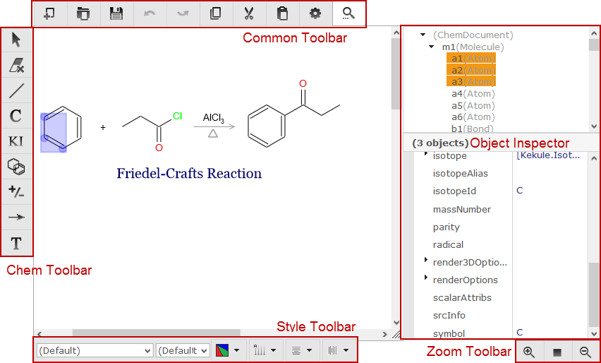
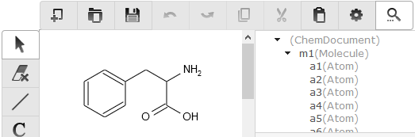
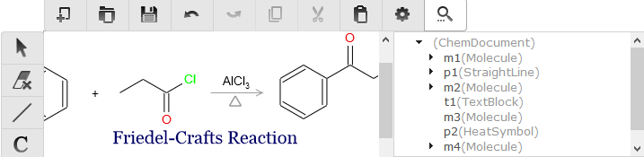
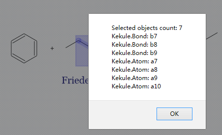
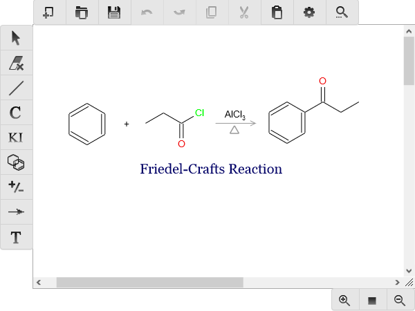
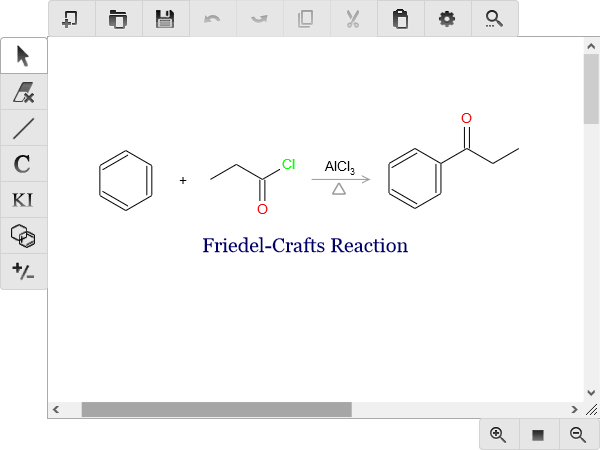
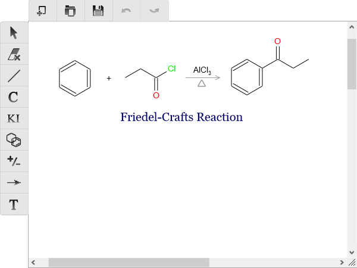

Composer Widget
===============

In the toolkit, composer is the dominate widget to input chemical structures.

Composer UI
-----------

  < Composer UI, with object inspect opened >

The primary part of composer is a input panel, in which user can draw chemical structures and
other objects. Around it there exist four toolbars as shown in figure above. The common toolbar
provides general purpose functions such as load/save, undo/redo and copy/paste:

.. table:: Buttons in common toolbar

  ==========  ================  =============
  Button      Name              Description
  ==========  ================  =============
  |B0|        newDoc            Create a new blank document to edit.
  |B1|        loadData          Load external data file to composer.
  |B2|        saveData          Save object inside composer to file.
  |B3|        undo              Undo previous operation.
  |B4|        redo              Redo last operation.
  |B5|        copy              Copy selection to internal clipboard. [#clipboard]_
  |B6|        cut               Cut selection to internal clipboard. [#clipboard]_
  |B7|        paste             Paste from clipboard. [#clipboard]_
  |B8|        config            Change the configurations of composer.
  |B9|        objInspector      Open or hide object inspector panel.
  ==========  ================  =============

.. |B0| image:: images/widgets/btnNewDoc.png
.. |B1| image:: images/widgets/btnLoad.png
.. |B2| image:: images/widgets/btnSave.png

.. |B5| image:: images/widgets/btnCopy.png

.. |B7| image:: images/widgets/btnPaste.png
.. |B8| image:: images/widgets/btnSettings.png

The zoom toolbar simply contains zoom in/out and reset buttons:

.. table:: Buttons in zoom toolbar

  ==========  ================  =============
  Button      Name              Description
  ==========  ================  =============
  |B10|       zoomIn            Zoom in objects in composer.
  |B11|       zoomOut           Zoom out objects in composer.
  |B12|       reset             Reset zoom level to 1.
  ==========  ================  =============

.. |B10| image:: images/widgets/btnZoomIn.png
.. |B11| image:: images/widgets/btnZoomOut.png
.. |B12| image:: images/widgets/btnReset.png

The chem toolbar enables user to input, remove or select different types of chemistry objects.
The operating practices of inputting molecule are quite similar to existing chemistry editors
like ChemDraw and JME.

.. table:: Buttons in chem toolbar

  ==========  ================  =============
  Button      Name              Description
  ==========  ================  =============
  |B20|       manipulate        Select objects in composer.
  |B21|       erase             Remove selection in composer.
  |B22|       bond              Input different types of molecule bond.
  |B23|       atom              Input atom symbol.
  |B24|       formula           Input molecule formula.
  |B25|       ring              Input typical ring structures with 3-9 atoms.
  |B26|       charge            Input negative or positive charge on atom.
  |B27|       glyph             Input glyphs and symbols such as reaction arrow and heat symbol.
  |B28|       textBlock         Input a block of plain text.
  ==========  ================  =============

.. |B23| image:: images/widgets/btnAtom.png

The style toolbar consists of two drop box to select font name and size of text,
three drop button to change text direction and horizontal/vertical alignment and
a drop button to change change color of objects.

All those toolbars are configurable and we will discuss it later.

A special object inspector can be opened by click on *objInspector* button in common toolbar.
It provides a structural view of all objects in editor and enables user change all properties
of selected objects. The concept of object inspector is borrowed from some programming environments
and not familiar with chemists, but it is real helpful to control some unusual aspect of atoms,
bonds and other objects.

Creating Composer
-----------------

For developers, creating a composer is as simple as other widgets in the toolkit:

::

  var composer = new Kekule.Editor.Composer(document);
  composer.setDimension('600px', '400px');
  composer.appendToElem(document.getElementById('parent')).setChemObj(molecule);

  // or create on existing element
  var composer = new Kekule.Editor.Composer(document.getElementById('div1'));

In HTML binding way:[#example]_

.. code-block:: html

  

Note the ``chemObj`` property is set by ``data-chem-obj`` attribute in the HTML code above,
thus molecule from that :ref:`resource <loadingFromResource>`
(``"url(#molecule)"``) will be loaded automatically into the composer.

Loading and Retrieving Molecules in Composer
--------------------------------------------

Similar to chem viewer, you can load object in composer by ``chemObj`` property.
The following code will load a molecule into composer:[#example]_

::

  composer.setChemObj(molecule);

However, after loading the molecule, if checking the object inspector, you may find
that the root object in composer is not molecule, but a *ChemDocument*, with molecule
as its child. This is because composer supports editing multiple molecules (and other types
of objects) in one document (like ChemDraw), so a extra root *ChemDocument* instance
need to be created automatically to hold all those molecules. So the ``chemObj`` property
getter will always returns this root chem document.

  < The structure of object tree in composer after loading a molecule  >

  < The structure of object tree in composer with multiple molecules and objects  >

If you want to retrieve a certain type of child objects in document, method ``exportObjs``
can be used:[#example]_

::

  // Get all molecules inside editor
  var mols = getComposer().exportObjs(Kekule.Molecule);
  // dump information
  var msg = 'Molecule count: ' + mols.length + '\n';
  for (var i = 0, l = mols.length; i < l; ++i)
  {
    var mol = mols[i];
    msg += '--------------------\n' + Kekule.IO.saveFormatData(mol, 'cml') + '\n';
  }
  console.log(msg);

The following codes get the first molecule in composer, then display it in
a chem viewer widget:[#example]_

::

  // Get all molecules inside editor
  var molecule = composer.exportObjs(Kekule.Molecule)[0];
  // Display in viewer
  if (molecule)
    Kekule.Widget.getWidgetById('viewer').setChemObj(molecule);

Of course, the viewer is also able to display the whole chem document:

::

  var chemDoc = composer.getChemObj();
  Kekule.Widget.getWidgetById('viewer').setChemObj(chemDoc);

Get Selected Objects
--------------------

User often selects parts of molecule in composer. The selection information
can be get by ``selection`` property of composer:[#example]_

::

  var selObjs = composer.getSelection();
  // dump information
  var msg = 'Selected objects count: ' + selObjs.length;
  for (var i = 0, l = selObjs.length; i < l; ++i)
  {
    msg += '\n' + selObjs[i].getClassName() + ': ' + (selObjs[i].getId() || '');
  }
  alert(msg);

The codes above usually will prints all selected atoms and bonds in a molecule.

Operation History
-----------------

In the composer, user may modify molecules and other types of objects.
All modifications are recorded by default. So unlimited undo/redo action is
possible:[#example]_

::

  composer.undo();  // undo last modification
  composer.redo();  // redo last modification

If the operation history is not necessary, you can disable it too:

::

  composer.setEnableOperHistory(false);

Limiting the Functions of Composer
----------------------------------

Sometimes, you may want to limit the ability of a composer, for example, disable
creating new document or disable loading objects:[#example]_

::

  composer.setEnableCreateNewDoc(false);
  composer.setEnableLoadNewFile(false);

Such limitations forces user to focus on currently objects in composer.

Another limitation is disable creating new child object in composer. It is quite
useful to force user to only edit one molecule at once:[#example]_

::

  composer.setAllowCreateNewChild(false);

Customize UI of Composer
------------------------

All toolbars in composers can be easily customized like chem viewer:[#example]_

::

  // Set displayed buttons in common and zoom toolbar
  composer.setCommonToolButtons(['newDoc', 'loadData', 'saveData', 'zoomIn', 'zoomOut']);

  // Set displayed buttons in chem toolbar
  composer.setChemToolButtons(['manipulate', 'erase', 'bond', 'atom', 'ring', 'charge']);

  // Set displayed components in style toolbar
  composer.setStyleToolComponentNames(['color', 'textDirection', 'textAlign']);
  // hide style toolbar totally
  composer.setEnableStyleToolbar(false);

Presets
-------

Some typical presets of composer are also provided as a shortcut of setting varies of properties.
Change to a preset by method ``setPredefinedSetting``:[#example]_

::

  // change to preset fullFunc
  composer.setPredefinedSetting('fullFunc');

**'fullFunc'**
  Composer with full functions, toolbar with all buttons. Equals to:

::

  composer
    .setEnableStyleToolbar(true)
    .setEnableOperHistory(true)
    .setEnableLoadNewFile(true)
    .setEnableCreateNewDoc(true)
    .setAllowCreateNewChild(true)
    .setCommonToolButtons(['newDoc', 'loadData', 'saveData', 'undo', 'redo', 'copy', 'cut', 'paste',
      'zoomIn', 'reset', 'zoomOut', 'config', 'objInspector'])   // create all default common tool buttons
    .setChemToolButtons(['manipulate', 'erase', 'bond', 'atom', 'formula',
      'ring', 'charge', 'glyph', 'textBlock'])   // create all default chem tool buttons
    .setStyleToolComponentNames(['fontName', 'fontSize', 'color',
      'textDirection', 'textAlign']);  // create all default style components

**'molOnly'**
  Displays only buttons related with molecule. Useful for restricting user input to molecule.

::

  composer
    .setEnableStyleToolbar(true)
    .setEnableOperHistory(true)
    .setEnableLoadNewFile(true)
    .setEnableCreateNewDoc(true)
    .setAllowCreateNewChild(true)
    .setCommonToolButtons(['newDoc', 'loadData', 'saveData', 'undo', 'redo', 'copy', 'cut', 'paste',
      'zoomIn', 'reset', 'zoomOut', 'config', 'objInspector'])   // create all default common tool buttons
    .setChemToolButtons(['manipulate', 'erase', 'bond', 'atom', 'formula',
      'ring', 'charge'])   // create only chem tool buttons related to molecule
    .setStyleToolComponentNames(['fontName', 'fontSize', 'color',
      'textDirection', 'textAlign']);  // create all default style components

**'compact'**
  Toolbar with most essential buttons. Equals to:

::

  composer
    .setEnableStyleToolbar(false)  // do not show style toolbar
    .setCommonToolButtons(['newDoc', 'loadData', 'saveData', 'undo', 'redo'])  // create a small number of tool buttons
    .setChemToolButtons(['manipulate', 'erase', 'bond', 'atom', 'formula',
      'ring', 'charge', 'glyph', 'textBlock']);   // create all default chem tool buttons

More Configurations
-------------------

Clicking on *Change Settings* button in the common toolbar, you may find that there are many other
configurable properties which affect many other aspects of composer, like interaction style, molecule
render style, text font style and color style. Those settings are all encapsulated in ``renderConfigs``
and ``editorConfigs`` properties of composer. As those two properties are quite complex, they will not
be explained further in this tutorial. You may check the API document for their details.

.. [#clipboard] Actually, clipboard of native OS can be be accessed by HTML and JavaScript
  directly, so the clipboard operations in Kekule.js are simulated by
  `local storage <https://developer.mozilla.org/en-US/docs/Web/API/Window/localStorage>`_.
.. [#example] Example of this chapter can be found and run at `here <../examples/composer.html>`_.