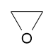
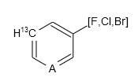
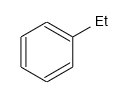
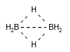
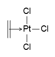

Creating Molecule
=================

Molecule is the core concept in chemoinformatics. This chapter will illustrate some basic
operations of molecules, especially organic molecules with connection table, in JavaScript code.

Creating Molecule with Atoms and Bonds
--------------------------------------

The following code create a new oxirane molecule with three atoms and three bonds:[#example]_

::

	// create molecule first
	var mol = new Kekule.Molecule();
	// add three atoms to molecule, property setter can be called cascadely
	var a1 = (new Kekule.Atom()).setSymbol('C').setCoord2D({'x': -0.4, 'y': 0.23});
	var a2 = (new Kekule.Atom()).setSymbol('C').setCoord2D({'x': 0.4, 'y': 0.23});
	var a3 = (new Kekule.Atom()).setSymbol('O').setCoord2D({'x': 0, 'y': -0.46});
	mol.appendNode(a1);
	mol.appendNode(a2);
	mol.appendNode(a3);
	// add three bonds to molecule
	var b1 = (new Kekule.Bond()).setBondOrder(1).setConnectedObjs([a1, a2]);
	var b2 = (new Kekule.Bond()).setBondOrder(1).setConnectedObjs([a2, a3]);
	var b3 = (new Kekule.Bond()).setBondOrder(1).setConnectedObjs([a3, a1]);
	mol.appendConnector(b1);
	mol.appendConnector(b2);
	mol.appendConnector(b3);

Molecule oxirane created with code:

Atoms or bonds can also be easily removed from existing molecule:[#example]_

::

	// remove atom O related bonds in molecule
	mol.removeNodeAt(2);  // the atom index starts from 0
		// or mol.removeNode(mol.getNodeAt(2));
	mol.removeConnectorAt(1);
		// or mol.removeConnector(mol.getConnectorAt(1));
	mol.removeConnectorAt(2);

Molecule after removing atom O:

Aside from normal atoms, pseudo atom and variable atom are also supported:[#example]_

::

	var mol = new Kekule.Molecule();

	// add atoms to molecule
	mol.appendNode(new Kekule.Atom().setSymbol('C').setCoord2D({x: 0, y: 0.80}));
	// explicit set mass number of an atom
	mol.appendNode(new Kekule.Atom().setSymbol('C').setMassNumber(13).setCoord2D({x: -0.69, y: 0.40}));
	mol.appendNode(new Kekule.Atom().setSymbol('C').setCoord2D({x: -0.69, y: -0.40}));
	// a pseudo atom
	mol.appendNode(new Kekule.Pseudoatom().setAtomType(Kekule.PseudoatomType.ANY).setCoord2D({x: 0, y: -0.80}));
	mol.appendNode(new Kekule.Atom().setSymbol('C').setCoord2D({x: 0.69, y: -0.40}));
	mol.appendNode(new Kekule.Atom().setSymbol('C').setCoord2D({x: 0.69, y: 0.40}));
	// a variable atom
	mol.appendNode(new Kekule.VariableAtom().setAllowedIsotopeIds(['F', 'Cl', 'Br']).setCoord2D({x: 1.39, y: 0.80}));

	// add bonds to molecule
	//   here a shortcut method appendBond(atomIndexes, bondOrder) is used
	mol.appendBond([0, 1], 1);
	mol.appendBond([1, 2], 2);
	mol.appendBond([2, 3], 1);
	mol.appendBond([3, 4], 2);
	mol.appendBond([4, 5], 1);
	mol.appendBond([5, 0], 2);
	mol.appendBond([5, 6], 1);

The result will be:

Even the subgroup:[#example]_

::

	var mol = new Kekule.Molecule();

	// add atoms to molecule
	mol.appendNode(new Kekule.Atom().setSymbol('C').setCoord2D({x: 0, y: 0.80}));
	mol.appendNode(new Kekule.Atom().setSymbol('C').setCoord2D({x: -0.69, y: 0.40}));
	mol.appendNode(new Kekule.Atom().setSymbol('C').setCoord2D({x: -0.69, y: -0.40}));
	mol.appendNode(new Kekule.Atom().setSymbol('C').setCoord2D({x: 0, y: -0.80}));
	mol.appendNode(new Kekule.Atom().setSymbol('C').setCoord2D({x: 0.69, y: -0.40}));
	mol.appendNode(new Kekule.Atom().setSymbol('C').setCoord2D({x: 0.69, y: 0.40}));

	// create a sub group
	var sub = new Kekule.SubGroup();
	// add atoms/bonds to sub structure
	sub.appendNode(new Kekule.Atom().setSymbol('C').setCoord2D({x: 1.39, y: 0.80}));
	sub.appendNode(new Kekule.Atom().setSymbol('C').setCoord2D({x: 2.0, y: 0.40}));
	sub.appendBond([0, 1], 1);
	// atom 0 in subgroup connected with main body
	sub.appendAnchorNode(sub.getNodeAt(0));
	sub.setAbbr('Et');

	// then add sub structure to molecule
	mol.appendNode(sub);

	// add bonds to molecule
	//   here a shortcut method appendBond(atomIndexes, bondOrder) is used
	mol.appendBond([0, 1], 1);
	mol.appendBond([1, 2], 2);
	mol.appendBond([2, 3], 1);
	mol.appendBond([3, 4], 2);
	mol.appendBond([4, 5], 1);
	mol.appendBond([5, 0], 2);
	mol.appendBond([5, 6], 1);  // bond connecting subgroup

The result:

Multicenter Bonds
-----------------

The toolkit supports multicenter bonds (e.g., B-H-B bond in diborane and Cp-Fe bond in ferrocene).
Such bond can be created by assigning multiple connected atoms:[#example]_

::

	// create molecule
	var mol = new Kekule.Molecule();

	// add atoms to molecule
	mol.appendNode(new Kekule.Atom().setSymbol('B').setExplicitHydrogenCount(2).setCoord2D({x: -1, y: 0}));
	mol.appendNode(new Kekule.Atom().setSymbol('B').setExplicitHydrogenCount(2).setCoord2D({x: 1, y: 0}));
	mol.appendNode(new Kekule.Atom().setSymbol('H').setCoord2D({x: 0, y: 1}));
	mol.appendNode(new Kekule.Atom().setSymbol('H').setCoord2D({x: 0, y: -1}));
	// add two multicenter bond: B-H-B
	mol.appendBond([0, 2, 1], 1);
	mol.appendBond([0, 3, 1], 1);

.. note:: Currently the toolkit draws multicenter bond by simply connecting all centers.
 This should be improved in the future.

Bond-bond Connection
--------------------

Special bond-bond connection (e.g., in Zeise's salt) is also supported:[#example]_

::

	// create molecule
	var mol = new Kekule.Molecule();

	var atomPt = new Kekule.Atom();  // Pt atom
	mol.appendNode(atomPt.setSymbol('Pt').setCoord2D({x: 0.35, y: 0}));
	mol.appendNode(new Kekule.Atom().setSymbol('Cl').setCoord2D({x: 0.35, y: 0.80}));
	mol.appendNode(new Kekule.Atom().setSymbol('Cl').setCoord2D({x: 0.35, y: -0.80}));
	mol.appendNode(new Kekule.Atom().setSymbol('Cl').setCoord2D({x: 1.14, y: 0}));
	mol.appendNode(new Kekule.Atom().setSymbol('C').setCoord2D({x: -0.45, y: 0.40}));
	mol.appendNode(new Kekule.Atom().setSymbol('C').setCoord2D({x: -0.45, y: -0.40}));

	mol.appendBond([1, 0], 1, Kekule.BondType.IONIC);  // Pt-Cl
	mol.appendBond([2, 0], 1, Kekule.BondType.IONIC);  // Pt-Cl
	mol.appendBond([3, 0], 1, Kekule.BondType.IONIC);  // Pt-Cl
	var doubleBond = mol.appendBond([4, 5], 2);        // C=C
	// create bond-bond connection
	var coordinateBond = new Kekule.Bond();            // (C=C)-Pt
	coordinateBond.setBondType(Kekule.BondType.COORDINATE);
	coordinateBond.setConnectedObjs([doubleBond, atomPt]);
	mol.appendConnector(coordinateBond);

However, it is very rare to create a molecule by pure JavaScript codes. Usually user loads a molecule from
external data (e.g., a file or a piece of string). This process will be introduced at
:doc:`next part </content/molIO>` of this tutorial.

.. [#example] Example of this chapter can be found and run at `here <../examples/creatingMol.html>`_.