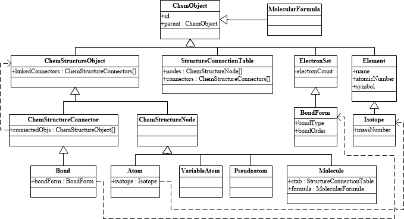

Object and Class System of Kekule.js
=====================================

Kekule.js is an object-oriented chemoinformatics toolkit written in JavaScript.
Developers usually need to dealing with objects and classes.
Concepts in chemistry, such as atom, bond and molecule are represented as objects in the toolkit
and different types of concepts deprived from different classes.
The following simplified UML diagram shows some core classes and their relations of the toolkit.

  < Simplified UML diagram of core classes >

Defining New Class
------------------

Developers can even deprive their own new classes from those existing ones. Traditionally,
defining class in JavaScript involves in a lot of ugly and clumsy codes. To simplify that
process, Kekule.js provides a handy way to define new classes (similar as the approach of
prototype.js):[#example]_

.. code-block:: javascript

  var MyCustomAtom = Class.create(Kekule.Atom, { // Creating a new class deprived from Kekule.Atom
    CLASS_NAME: 'MyCustomAtom',                  // Explicitly set the name of class
    initialize: function($super, id)             // Method initialize will be regarded as constructor of class
    {
      $super(id);                                // Use $super parameter to call inherited method from ancestor class
      this._customText = 'My value';
    },
    initProperties: function()                   // Special method, defining new properties of class
    {
      this.defineProp('myProperty', {            // defining integer property: myProperty
        'dataType': DataType.INT,
        'getter': function() {
          console.log('Reading myProperty');     // additional operation in property getter
          return this.getPropStoreFieldValue('myProperty');  // return value from default storing field of object
        },
        'setter': function(value)
        {
          console.log('Writing myProperty');     // additional operation in property setter
          this.setPropStoreFieldValue('myProperty', value);  // set value to default storing field of object
        }
      });
      this.defineProp('customText', {            // defining string property: customField
        'dataType': DataType.STRING,
        'getter': function() { return this._customText; },      // return value from a custom storing field
        'setter': function(value) { this._customText = value; } // set value to a custom storing field
      });
    },
    showNewPropertyValues: function()            // defining new method
    {
      console.log(this.getMyProperty(), this.getCustomText());
    }
  });

Method Class.create is used to create a new class and this method accept two parameters. The first
parameter is the ancestor class which can be omitted if the new class does not inherit from any existing
ones. The second parameter is a JavaScript object defining the methods and attributes of new class. Among
those methods, there are two special ones: *initialize* plays as the constructor of class and *initProperties*
defines all new properties of class.

In Kekule.js class system, property is a little different from traditional JavaScript property. In order
to avoid compatiblity problems in different web browsers, property need be accessed by getter and setter
methods (e.g ``getMyProperty()``, ``setCustomText('Text')``). Aside from read/write value to property itself,
getter and setter methods are able to perform some additional operations as shown in the previous example.

Create Instance of Class
------------------------

After defining the new class, developer can create new instances same as traditional JavaScript:[#example]_

.. code-block:: javascript

  var myInstance = new MyCustomAtom('myId');  // create new instance
  myInstance.setMyProperty(10).setCustomText('Custom Text');  // set property values
  myInstance.setSymbol('Cl');   // set property value inherited from ancestor classes
  console.log(myInstance.getAtomicNumber());  // get property value inherited from ancestor classes
  var dupInstance = myInstance.clone();        // access inherited method
  console.log(
    dupInstance.getSymbol(),
    dupInstance.getMyProperty(),
    dupInstance.getCustomText()
  );

Serialize/deserialize of Object
-------------------------------

Kekule.js provides methods to save/load class instances to/from JSON or XML. Different from traditional
JSON approaches, those methods usually only save/load defined properties of object. [#example]_

.. code-block:: javascript

  var jsonData = {};
  myInstance.saveObj(jsonData, 'json');
  var newInstance = new MyCustomAtom();
  newInstance.loadObj(jsonData, 'json');
  console.log(
    newInstance.getSymbol(),
    newInstance.getMyProperty(),
    newInstance.getCustomText()
  );

.. [#example] Example of this chapter can be found and run at `here <../examples/objSys.html>`_.
