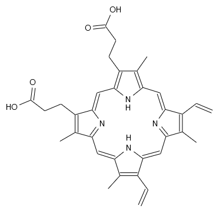

Drawing Molecule
================

The ability to display intuitive image of molecule is one of the most important
features of chemoinformatics-related programs. However, drawing graphics on HTML
page is more complex than one's first sense.

Background Introduction
-----------------------

In the history of web evolution, there emerges several technologies to draw 2D graphic.
Firstly proprietary `VML <https://en.wikipedia.org/wiki/Vector_Markup_Language>`_ by
Microsoft Internet Explorer, then `SVG <https://developer.mozilla.org/en-US/docs/Web/SVG>`_
proposed by W3C, at last the `Canvas <https://developer.mozilla.org/en-US/docs/Web/API/Canvas_API>`_.
Different technologies requires different drawing context, normal
HTML element (like ``
``) for **VML**, ``<svg>`` element for **SVG** and ``<canvas>``
for **Canvas**. Most modern web browsers supports **Canvas** well but there still
exists legacy browsers in market. For instance, default web browser before Android 2.1
supports **SVG** but does not support **Canvas**; MS IE does not supported **SVG** and
**Canvas** until version 9. For 3D drawing in web, the preferred technology is **WebGL**
but legacy browsers have poor supports on it too. So web developer has to facing different
graphics technologies and different drawing context in different environment.

Instead of calling to those technologies directly, bridge pattern is used in Kekule.js
to achieve platform independency as shown in next figure. Concrete drawing work (e.g., drawing
line, drawing text) is assigned to to a specified *drawing bridge* which can be created based on
current environment. That approach helps developer to avoid the difference of
VML, SVG and Canvas and to concentrate on one set of code runs in different platform.

.. figure:: images/renderSystemUml.png
  :align: center

  < Simplified UML diagram of rendering system >

To draw a molecule on screen, a special *renderer* class will be used. However, besides
molecule, there often to be many other types of objects in a chemoinformatics application
(e.g., text, formula, reaction arrow) and they requires different renderers. So factory
method pattern is applied here. Rather than calling a *renderer* class directly, you should
query the *renderer manager* to return a preferred class for molecule (or other types of object).

After those background introduction, now let us implement those knowledge in code. [#module]_

Drawing by Renderer
-------------------

Before drawing, do not forget to include two additional JavaScript libraries in HTML
page. Raphael.js for 2D drawing (unless your target enviroment all supports **Canvas**)
and Three.js for 3D drawing as mention in the :ref:`Installation<libsForRendering>` part
of this tutorial.

.. code-block:: html

	
	
	

The following code snippet can be used to draw a molecule. [#example]_ It can be divided into several steps:

  1. Line 2, we check the render type, decide which form, 2D or 3D graphics should be made.
  2. Line 5-7, old content in parent HTML element is cleared.
     We are preparing to draw inside it later.
  3. Line 10-12, a suitable *draw bridge* is created.
  4. Line 15-16, a suitable *draw context* is created inside parent HTML element.
  5. Line 18-23, a *renderer* class for molecule is found.
  6. Line 24, concrete *renderer* object is created, bind with molecule and draw bridge.
  7. Line 26-40, prepare options for drawing.
  8. Line 43, at last, draw the molecule to *context* by *renderer*.

.. code-block:: javascript
  :linenos:

  var renderType = Kekule.Render.RendererType.R2D//R3D  // do 2D or 3D drawing
  var is3D = (renderType === Kekule.Render.RendererType.R3D);

  // parent HTML element, we will draw inside it
  var parentElem = document.getElementById('parent');
  // clear parent elem
  Kekule.DomUtils.clearChildContent(parentElem);

  // Get suitable draw bridge for 2D or 3D drawing
  var drawBridgeManager = is3D? Kekule.Render.DrawBridge3DMananger:
    Kekule.Render.DrawBridge2DMananger;
  var drawBridge = drawBridgeManager.getPreferredBridgeInstance();

  // then create render context by drawBridge first
  var dim = Kekule.HtmlElementUtils.getElemOffsetDimension(parentElem); // get width/height of parent element
  var context = drawBridge.createContext(parentElem, dim.width, dim.height);  // create context fulfill parent element

  // then create suitable renderer to render molecule object
  var rendererClass;
  if (is3D)
    rendererClass = Kekule.Render.get3DRendererClass(mol);
  else
    rendererClass = Kekule.Render.get2DRendererClass(mol);
  var renderer = new rendererClass(mol, drawBridge);  // create concrete renderer object and bind it with mol and draw bridge

  /*
  prepare render options, options is a something like

  var options = {
    atomColor: '#000000',
    bondColor: '#000000',
    defBondLength: 30
    ...
  };
  it is quite complex, so we use some magic here, generate the option object by default configuration of Kekule.js.
  */

  var configObj = is3D? Kekule.Render.Render3DConfigs.getInstance():
    Kekule.Render.Render2DConfigs.getInstance();
  var options = Kekule.Render.RenderOptionUtils.convertConfigsToPlainHash(configObj);

  // at last, draw the molecule to the center of context
  renderer.draw(context, {'x': dim.width / 2, 'y': dim.height / 2}, options);

For example, if the ``mol`` is loaded with porphyrin data and ``renderType`` is set to
``Kekule.Render.RendererType.R2D``, the following graphic can be drawn to screen:

Of course, the codes above is quite complex (the complexity is a cost of
extensibility and platform independency), developer have to create *draw bridge*, *context*
and *renderer* one by one manually. To simplify that process, a special *painter* class
is introduced in the toolkit.

Drawing by Painter
------------------

The *painter* is a special class which can create suitable *bridge*, *context* and *renderer*
for us automatically. The following code snippet is used to draw molecule with painter:[#example]_

::

  var renderType = Kekule.Render.RendererType.R2D//R3D  // do 2D or 3D drawing

  // parent element, we will draw inside it
  var parentElem = document.getElementById('parent');
  // clear parent elem
  Kekule.DomUtils.clearChildContent(parentElem);

  // create painter, bind with molecule
  var painter = new Kekule.Render.ChemObjPainter(renderType, mol);

  // create context inside parentElem
  var dim = Kekule.HtmlElementUtils.getElemOffsetDimension(parentElem); // get width/height of parent element
  var context = painter.createContext(parentElem, dim.width, dim.height); // create context fulfill parent element

  // at last, draw the molecule at the center of context
  painter.draw(context, {'x': dim.width / 2, 'y': dim.height / 2});

Actually, molecule and other types of objects can all be drawn to HTML page in such a way.
For instance, the following code draws an balance arrow:[#example]_

::

  // Create arrow glyph with initial parameters
  var glyph = new Kekule.Glyph.StraightLine('glyph1', 1, {
        'startArrowType': Kekule.Glyph.ArrowType.OPEN,
        'startArrowSide': Kekule.Glyph.ArrowSide.REVERSED,
        'startArrowWidth': 0.25,
        'startArrowLength': 0.25,
        'endArrowType': Kekule.Glyph.ArrowType.OPEN,
        'endArrowSide': Kekule.Glyph.ArrowSide.SINGLE,
        'endArrowWidth': 0.25,
        'endArrowLength': 0.25,
        'lineLength': 1.5,
        'lineGap': 0.1,
        'lineCount': 2
      });
  // create new painter, bind with glyph
  var painter = new Kekule.Render.ChemObjPainter(Kekule.Render.RendererType.R2D, glyph);
  // draw the glyph at the center of context we previous created
  painter.draw(context, {'x': dim.width / 2, 'y': dim.height / 2});

The result:

.. image:: images/examples/balanceArrow.png

It is obvious that two code snippets are much more shorter than the one by using
*renderer* directly. However, there do exists a even simpler method to display
chemoinformatics objects: using **widget**.

.. [#module] To draw molecule as examples in this chapter, render module must be loaded, e.g.:
.. code-block:: html

	

.. [#example] Example of this chapter can be found and run at `here <../examples/renderMol.html>`_.