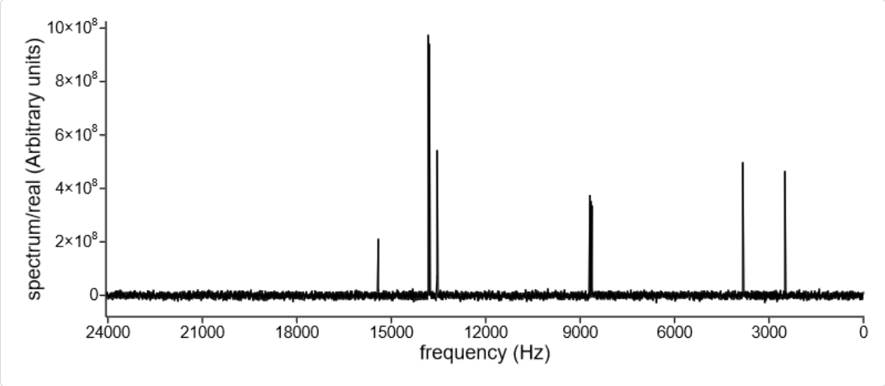
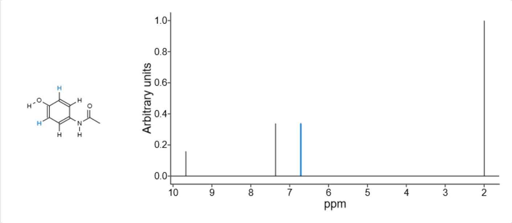

Spectra in Kekule.js
============================

From version 0.9.9, Kekule.js provides some basic support for spectroscopy, including the input/ouput/display of
spectra data. The core class of the spectra system is ``Kekule.Spectroscopy.Spectrum``.

I/O of Spectra Data
-------------------------

Currently, the `JCAMP-DX <http://jcamp-dx.org/>`_ and `CMLSpect <https://pubs.acs.org/doi/abs/10.1021/ci600531a/>`_ formats
are supported in Kekule.js. The ordinary I/O API can be used to access or save those formats of data.
For example, to load the spectrum from data string:

::

    var cmlData = '<cml xmlns="http://www.xml-cml.org/schema" ...><spectrum id="UV_VIS" title="Holmium Oxide Wavelength Standard" convention="JSpecView" type="UV/VIS"> ... </spectrum></cml>';
    var spectrum1 = Kekule.IO.loadFormatData(cmlData, Kekule.IO.DataFormat.CML);  // an instance of Kekule.Spectroscopy.Spectrum will be returned
    var jcampData = '##TITLE=CCH-4\n##JCAMP-DX=4.24\n##DATA TYPE=INFRARED SPECTRUM ... ##END=';
    var spectrum2 = Kekule.IO.loadMimeData(cmlData, Kekule.IO.MimeType.JCAMP_DX);  // an instance of Kekule.Spectroscopy.Spectrum will be returned too

Other sources of input data (external file or resource identifier) are also applicable, e.g.:

::

    var url = 'data/spectra/sample.jdx';
    Kekule.IO.loadUrlData(url, function(spectrum, success){
        if (success)
            console.log('Spectrum successfully loaded', spectrum);
    });

It is notable that the structures of CML-spect or JCAMP data are flexible, multiple spectra and even molecules can be encapsulated
in one source file, so the returning value of those load functions may be a ``Kekule.ChemObjList`` rather than a simple ``Kekule.Spectroscopy.Spectrum``.
For example, suppose we have a JCAMP format file recording a NMR peak table and its reference molecule
(`ISAS_CDX_with_mol_correlation.DX <http://partridgejiang.github.io/Kekule.js/demos/chemFiles/spectrum/ISAS_CDX_with_mol_correlation.DX>`_):

.. code-block::

    ##TITLE= 4a-Phenyladamantan-2-one
    ##JCAMP-DX= 4.24
    ##DATA TYPE= LINK
    ##BLOCKS= 2
    ##TITLE= Structure: 4a-Phenyladamantan-2-one
    ##JCAMP-CS= 3.7
    ##BLOCK_ID= 1
    ##CROSS REFERENCE= NMR PEAK ASSIGNMENTS: BLOCK_ID= 2
    ##NAMES= 4a-Phenyladamantan-2-one
    ##MOLFORM= C16 H18 O
    ##ATOMLIST=
    $$ AN   AS NH
        1    C  1
        2    C
        ...
    ##BONDLIST=
    $$ AN1 AN2 BT
         2   1  S
         3   2  S
         ...
    ##END=   $$ End of the structure block
    ##TITLE= NMR data: 4a-Phenyladamantan-2-one
    ##JCAMP-DX= 5.00
    ##DATA TYPE= NMR PEAK ASSIGNMENTS
    ##DATA CLASS= ASSIGNMENTS
    ##BLOCK_ID= 2
    ##.OBSERVE NUCLEUS= ^13C
    ##CROSS REFERENCE= STRUCTURE: BLOCK_ID= 1
    ##SPECTROMETER/DATA SYSTEM= Bruker AM 400
    ##TEMPERATURE= 26.85
    ##XUNITS= PPM
    ##YUNITS= ARBITRARY UNITS
    ##NPOINTS= 16
    ##PEAK ASSIGNMENTS= (XYMA)
    ( 27.00, 1.0,, < 7>)
    ( 32.10, 1.0,, < 6>)
    ...
    ##END=   $$ End of the NMR data block
    ##END=   $$ End of the compound JCAMP-DX file

::

    var url = 'fileAbove.jdx';
    Kekule.IO.loadUrlData(url, function(chemObjList, success){
        if (success)
        {
            var molecule = chemObjList.getChildAt(0);  // instanceof Kekule.Molecule
            var spectrum = chemObjList.getChildAt(1);  // instanceof Kekule.Spectroscopy.Spectrum
        }
    });

Similar to the loading, the ordinary ``Kekule.IO.saveXXXX`` series functions can be used to write spectrum into string:

::

    var cmlData = Kekule.IO.saveMimeData(spectrum, Kekule.IO.MimeType.CML);
    var jcampData = Kekule.IO.saveFormatData(spectrum, Kekule.IO.DataFormat.JCAMP_DX);
    var complexJcampData = Kekule.IO.saveFormatData(chemObjListWithSpectrum, Kekule.IO.DataFormat.JCAMP_DX);

Access Data inside Spectrum
-----------------------------------

After loading the spectrum, we can access the detailed spectrum data inside it.

Meta Data
~~~~~~~~~~~~~~~~

Following the CMLSpect conventions, the meta data stored in spectrum file are categorized into several groups
(*condition*, *parameter*, *metaData* and *annotations*) in Kekule.js.Corresponding ``getXXXX`` and ```setXXXX`` methods
can be used to read or write those values. The ``getXXXXKeys`` method will returns all keys of this category.
Regardless of the category, method ``getSpectrumInfoValue`` can also be used to retrieve any type of values.
For example, after reading out the following JCAMP-DX file
(`BRUKPAC.DX <http://partridgejiang.github.io/Kekule.js/demos/chemFiles/spectrum/BRUKPAC.DX>`_),
those get/set methods can be used as following:

.. code-block::

    ##TITLE= test32
    ##JCAMPDX= 5.0
    ##DATA TYPE= NMR Spectrum
    ##DATA CLASS= XYDATA
    ##ORIGIN= uk
    ##OWNER= uk
    ##.OBSERVE FREQUENCY= 100.4
    ##.OBSERVE NUCLEUS= ^13C
    ##.ACQUISITION MODE= SIMULTANEOUS
    ##.AVERAGES= 32
    ##.DIGITISER RES= 16
    ##SPECTROMETER/DATA SYSTEM= JEOL GX 400
    ...

::

    // suppose we have read the file into spectrum object
    console.log(spectrum.getParameterKeys());  // [ "NMR.ObserveFrequency", "NMR.ObserveNucleus", "NMR.AcquisitionMode" ]
    console.log(spectrum.getParameter('NMR.ObserveNucleus));  // 'C13'
    var freq = spectrum.getParameter('NMR.ObserveFrequency);  // freq is an instance of Kekule.Scalar
    console.log(freq.getValue(), freq.getUnit());  // 100.4, "MHz"
    console.log(spectrum.getMetaKeys());  // [ "Origin", "Owner", "SpectrometerDataSystem" ]
    console.log(spectrum.getMeta('Origin'));  // "uk"
    console.log(spectrum.getAnnotationKeys());  // [ "JcampDxVersion", "NMR.Averages", "NMR.DigitiserRes", … ]
    console.log(spectrum.getAnnotation('JcampDxVersion'));   // "5.0"
    console.log(spectrum.getAnnotation('NMR.Averages'));  // "32"
    // use the getSpectrumInfoValue method to retrieve meta data
    console.log(spectrum.getSpectrumInfoValue('Origin')));   // "uk"
    console.log(spectrum.getSpectrumInfoValue('NMR.ObserveNucleus')));   // "C13"
    // change the origin and owner of spectrum
    spectrum.setMeta('Origin', 'self');
    spectrum.setMeta('Owner', 'self');

.. note::

    When loading spectrum data, some important meta key names will be converted. For example, in the JCAMP-DX file above,
    line ``##.OBSERVE FREQUENCY= 100.4`` records the frequency of NMR spectrum. When loading the spectrum,
    the key will be converted into ``'NMR.ObserveFrequency'``, a more clear and user-friendly name.
    The value of the frequency is also converted into an instance of ``Kekule.Scalar``, with value 100.4 and unit 'MHz'.

Spectrum Data
~~~~~~~~~~~~~~~~~~~~~~

In CMLSpect, JCAMP-DX (and many other format), several different data sections may be wrapped in one spectrum.
So in Kekule.js, multiple instances of ``Kekule.Spectroscopy.DataSection``, in which the concrete data are stored,
are held in spectrum object. For example, the following code can be used to iterate data sections inside a spectrum:

::

    for (var i = 0, l = spectrum.getSectionCount(); i < l; ++i)
    {
        var dataSection = spectrum.getDataSectionAt(i);
        // ...
    }

``Kekule.Spectroscopy.DataSection`` provide a series of method to access its detailed data and other information.
Suppose we have a NTuple format JCAMP-DX file here
(`BRUKNTUP.DX <http://partridgejiang.github.io/Kekule.js/demos/chemFiles/spectrum/BRUKNTUP.DX>`_):

.. code-block::

    ##TITLE= testntup
    ##JCAMPDX= 5.0
    ##DATA TYPE= NMR Spectrum
    ##DATA CLASS= NTUPLES
    ##.OBSERVE FREQUENCY= 100.4
    ##.OBSERVE NUCLEUS= ^13C
    ##NTUPLES=NMR SPECTRUM
    ##VAR_NAME=  FREQUENCY,     SPECTRUM/REAL,   SPECTRUM/IMAG,   PAGE NUMBER
    ##SYMBOL=    X,             R,               I,               N
    ##VAR_TYPE=  INDEPENDENT,   DEPENDENT,       DEPENDENT,       PAGE
    ##VAR_FORM=  AFFN,          ASDF,            ASDF,            AFFN
    ##VAR_DIM=   16384,         16384,           16384,           2
    ##UNITS=     HZ,            ARBITRARY UNITS, ARBITRARY UNITS,
    ##FIRST=     24038.5 ,      2254931 ,        -6966283 ,       1
    ##LAST=      0 ,            1513177 ,        -7303022 ,       2
    ##MIN=       0 ,            -27593239 ,      -680128135 ,     1
    ##MAX=       24038.5 ,      972201806 ,      689619959 ,      2
    ##FACTOR=    1.46728315937252 , 1 ,          1 ,              1
    $$ Real data points
    ##PAGE= N=1
    ##DATA TABLE=(X++(R..R)), XYDATA
    16383 B254931p506547j928560N577988J2253771o290071q010940N785678N934030
    16375 H070280o319742J809880k462623o675783N340627q60434l560418J18681
    16367 d539532K551632l441737j691199N043926M658213J48350J127466k640643
    16359 A216476J513177J186806q752693N874689O82413M717554j4033980j424167
    ...
    $$ Imaginary data points
    ##PAGE= N=2
    ##DATA TABLE=(X++(I..I)), XYDATA
    16383 f966283o52431R849608Q439515p660807j0965055L556803R933793n977112
    16375 d41969o503268M63016J915202k651818Q313238r449731M882712J957294
    16367 a515324K10462J578462O94523M840620j115447n808743M314465r365546
    16359 f166528N366774m714343J220678R04986L683079n030034p871269R112993
    16351 c493664P702898m630157o482221k546587N008989J0375762k209848k31508
    ...
    ##END NTUPLES=NMR SPECTRUM
    ##END=

This file contains two NTuple pages, so after loading it, there should be two data sections inside the spectrum.
The following code demonstrates the manipulation of the data sections:

::

    var section1 = spectrum.getDataSectionAt(0);  // the first data section, DATA TABLE=(X++(R..R))
    console.log(section1.getLocalVarSymbols());   // [ "X", "R" ]
    section1.log(section1.getLocalVarInfo(0));    // { symbol: "X", continuousRange: { fromValue: 24038.499999999996, toValue: 0 } }
    section1.log(section1.getLocalVarInfo('X'));  // { symbol: "X", continuousRange: { fromValue: 24038.499999999996, toValue: 0 } }, same to above
    for (var i = 0, l = section1.getDataCount(); i < l; ++i)
    {
        var dataValue = section1.getDataValue(i);
        console.log(i, dataValue);    // 0, { X: 24038.499999999996, R: 2254931 }  ...
        section1.setValueAt({'X': dataValue.X * 2, 'R': dataValue.R});  // double the X value of each data item
    }

    var section2 = spectrum.getDataSectionAt(1);  // the second data section, DATA TABLE=(X++(I..I))
    console.log(section2.getLocalVarSymbols());   // [ "X", "I" ]
    section2.log(section2.getLocalVarInfo(1));    // { symbol: "I" }
    section2.forEach(function(value, index){      // Another way to iterate data values
        console.log(index, value);                // 0, { X: 24038.499999999996, I: -6966283 } ...
    });

Molecule Correlation
~~~~~~~~~~~~~~~~~~~~~~~~~~~~

The spectrum are often related with molecule structure. In Kekule.js, such information is stored
in the ``refMolecules`` property of ``Kekule.Spectroscopy.Spectrum``. In the spectrum peak table,
peaks may also be mapped to certain atoms/bonds of molecule. The ``Kekule.Spectroscopy.SpectrumDataDetails`` class
and ``get/setExtraInfoOf`` and ``get/setExtraInfoAt`` methods in class ``Kekule.Spectroscopy.SpectrumDataSection``
can be used to read or write the those peak assignments.

Suppose we have a JCAMP-DX file with molecule correlation and peak assignment information as following
(`ISAS_CDX_with_mol_correlation.DX <http://partridgejiang.github.io/Kekule.js/demos/chemFiles/spectrum/ISAS_CDX_with_mol_correlation.DX>`_):

.. code-block::

    ##TITLE= 4a-Phenyladamantan-2-one
    ##JCAMP-DX= 5.0
    ##DATA TYPE= LINK
    ##BLOCKS= 2
    ##TITLE= Structure: 4a-Phenyladamantan-2-one
    ##JCAMP-CS= 3.7
    ##BLOCK_ID= 1
    ##CROSS REFERENCE= NMR PEAK ASSIGNMENTS: BLOCK_ID= 2
    ##NAMES= 4a-Phenyladamantan-2-one
    ##MOLFORM= C16 H18 O
    ##ATOMLIST=
    $$ AN   AS NH
        1    C  1
        2    C
        3    C  1
        4    C  1
    ...
    ##BONDLIST=
    $$ AN1 AN2 BT
         2   1  S
         3   2  S
         5   4  S
    ...
    ##END=   $$ End of the structure block
    ##TITLE= NMR data: 4a-Phenyladamantan-2-one
    ##JCAMP-DX= 5.0
    ##DATA TYPE= NMR PEAK ASSIGNMENTS
    ##DATA CLASS= ASSIGNMENTS
    ##BLOCK_ID= 2
    ##.OBSERVE NUCLEUS= ^13C
    ##CROSS REFERENCE= STRUCTURE: BLOCK_ID= 1
    ##XUNITS= PPM
    ##YUNITS= ARBITRARY UNITS
    ##NPOINTS= 16
    ##PEAK ASSIGNMENTS= (XYMA)
    ( 27.00, 1.0,, < 7>)
    ( 32.10, 1.0,, < 6>)
    ( 34.00, 1.0,, < 4>)
    ( 37.70, 1.0,, <10>)
    ...
    ##END=   $$ End of the NMR data block
    ##END=   $$ End of the compound JCAMP-DX file

Since this file containing both molecule block and spectrum block, a instance of ``Kekule.ChemObjList``
will be created after loading it. The following code may be used to iterate all the peak assignments:

::

    var molecule = chemObjList.getChildAt(0);
    var spectrum = chemObjList.getChildAt(1);
    console.log(spectrum.getRefMolecules()[0] === molecule);   // true

    var dataSection = spectrum.getDataSectionAt(0);
    for (var i = 0, l; = dataSection.getDataCount(); i < l; ++i)
    {
        var dataValue = dataSection.getValueAt(i);
        var extraInfo = dataSection.getExtraInfoOf(value); // or dataSection.getExtraInfoAt(i);
        if (extraInfo instanceof Kekule.Spectroscopy.SpectrumDataDetails)  // true
        {
            var atom = extraInfo.getAssignment();
            console.log(molecule.indexOfNode(atom));   // 6, 5, 3, ...
        }
    }

Displaying Spectrum
--------------------------

Similar to other chemical objects, the :doc:`viewer<./chemViewer>` widget can always be used to display a simple spectrum.
For example, the following JavaScript codes load spectrum from
(`BRUKPAC.DX <http://partridgejiang.github.io/Kekule.js/demos/chemFiles/spectrum/BRUKPAC.DX>`_) and display the spectrum
in a existing viewer widget:

::

    Kekule.IO.loadUrlData('BRUKPAC.DX', function(spectrum, success){
        if (success)
        {
            viewer.setChemObj(spectrum);
        }
    });



    Displaying spectrum in viewer widget

If you want to show both spectrum and its correlated molecule together, the new spectrum inspector widget can be utilized.
It shares the same API to viewer and displays molecule automatically when there is a correlation.
The following code create a spectrum inspector by code and load a new spectrum inside it:

::

    var spectrumInspector = new Kekule.ChemWidget.spectrumInspector(document);
    spectrumInspector.appendToElem(document.body);
    spectrumInspector
        .setAssocViewerPosition(Kekule.Widget.Position.LEFT) // display molecule to the left of spectrum
        .setAssocViewerSize('25%');   // the molecule view occupies 1/4 of the total width of widget

    var url = 'MultiSpectraWithCorrelations.jdx';  // a JCAMP-DX file with several spectrums and correlated molecule inside
    Kekule.IO.loadUrlData(url, function(chemObjList, success){   // so a chem object list is created after loading the file
        if (success)
        {
            spectrumInspector.setChemObj(chemObjList);   // load the list directly in the inspector
        }
    });



    Displaying spectrum and its correlated molecule in spectrum inspector widget

.. note::

    As the above image illustrates, when a peak is selected, its assignments are automatically highlighted as well by default.

In both viewer and spectrum inspector, the interaction mode and display styles can be customized.
You may check the demo `SpectrumInspector <http://partridgejiang.github.io/Kekule.js/demos/demoLauncher.html?id=spectrumInspector>`_
for details.


